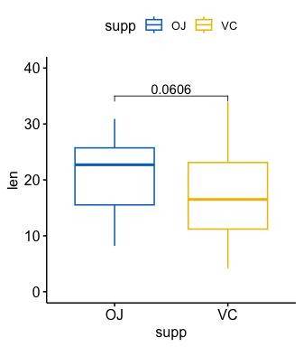
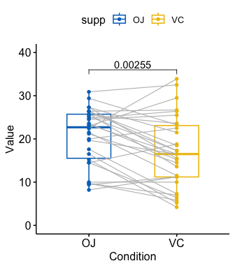
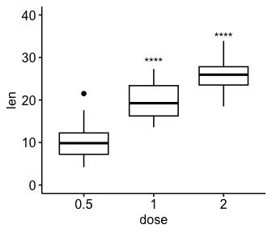

<!-- README.md is generated from README.Rmd. Please edit that file -->
[](https://travis-ci.org/kassambara/rstatix)
[](https://cran.r-project.org/package=rstatix)
[](https://cran.r-project.org/web/checks/check_results_rstatix.html)
[](https://cran.r-project.org/package=rstatix)
[](https://cran.r-project.org/package=rstatix)

rstatix
=======

Provides a simple and intuitive pipe-friendly framework, coherent with
the ‘tidyverse’ design philosophy, for performing basic statistical
tests, including t-test, Wilcoxon test, ANOVA, Kruskal-Wallis and
correlation analyses.

The output of each test is automatically transformed into a tidy data
frame to facilitate visualization.

Additional functions are available for reshaping, reordering,
manipulating and visualizing correlation matrix. Functions are also
included to facilitate the analysis of factorial experiments, including
purely ‘within-Ss’ designs (repeated measures), purely ‘between-Ss’
designs, and mixed ‘within-and-between-Ss’ designs.

It’s also possible to compute several effect size metrics, including
“eta squared” for ANOVA, “Cohen’s d” for t-test and “Cramer’s V” for the
association between categorical variables. The package contains helper
functions for identifying univariate and multivariate outliers,
assessing normality and homogeneity of variances.

Key functions
-------------

### Descriptive statistics

-   `get_summary_stats()`: Compute summary statistics for one or
    multiple numeric variables. Can handle grouped data.
-   `freq_table()`: Compute frequency table of categorical variables.
-   `get_mode()`: Compute the mode of a vector, that is the most
    frequent values.
-   `identify_outliers()`: Detect univariate outliers using boxplot
    methods.
-   `mahalanobis_distance()`: Compute Mahalanobis Distance and Flag
    Multivariate Outliers.
-   `shapiro_test()` and `mshapiro_test()`: Univariate and multivariate
    Shapiro-Wilk normality test.

### Comparing means

-   `t_test()`: perform one-sample, two-sample and pairwise t-tests
-   `wilcox_test()`: perform one-sample, two-sample and pairwise
    Wilcoxon tests
-   `sign_test()`: perform sign test to determine whether there is a
    median difference between paired or matched observations.
-   `anova_test()`: an easy-to-use wrapper around `car::Anova()` to
    perform different types of ANOVA tests, including **independent
    measures ANOVA**, **repeated measures ANOVA** and **mixed ANOVA**.
-   `get_anova_test_table()`: extract ANOVA table from `anova_test()`
    results. Can apply sphericity correction automatically in the case
    of within-subject (repeated measures) designs.
    `- welch_anova_test()`: Welch one-Way ANOVA test. A pipe-friendly
    wrapper around the base function `stats::oneway.test()`. This is is
    an alternative to the standard one-way ANOVA in the situation where
    the homogeneity of variance assumption is violated.
-   `kruskal_test()`: perform kruskal-wallis rank sum test
-   `friedman_test()`: Provides a pipe-friendly framework to perform a
    Friedman rank sum test, which is the non-parametric alternative to
    the one-way repeated measures ANOVA test.
-   `get_comparisons()`: Create a list of possible pairwise comparisons
    between groups.
-   `get_pvalue_position`: autocompute p-value positions for plotting
    significance using ggplot2.

### Facilitating ANOVA computation in R

-   `factorial_design()`: build factorial design for easily computing
    ANOVA using the `car::Anova()` function. This might be very useful
    for repeated measures ANOVA, which is hard to set up with the `car`
    package.
-   `anova_summary()`: Create beautiful summary tables of ANOVA test
    results obtained from either `car::Anova()` or `stats::aov()`. The
    results include ANOVA table, generalized effect size and some
    assumption checks, such as Mauchly’s test for sphericity in the case
    of repeated measures ANOVA.

### Post-hoc analyses

-   `tukey_hsd()`: performs tukey post-hoc tests. Can handle different
    inputs formats: aov, lm, formula.
-   `dunn_test()`: compute multiple pairwise comparisons following
    Kruskal-Wallis test.
-   `games_howell_test()`: Performs Games-Howell test, which is used to
    compare all possible combinations of group differences when the
    assumption of homogeneity of variances is violated.
-   `emmeans_test()`: pipe-friendly wrapper arround `emmeans` function
    to perform pairwise comparisons of estimated marginal means. Useful
    for post-hoc analyses following up ANOVA/ANCOVA tests.

### Comparing proportions

-   `prop_test()`, `pairwise_prop_test()` and `row_wise_prop_test()`.
    Performs one-sample and two-samples z-test of proportions. Wrappers
    around the R base function `prop.test()` but have the advantage of
    performing pairwise and row-wise z-test of two proportions, the
    post-hoc tests following a significant chi-square test of
    homogeneity for 2xc and rx2 contingency tables.
-   `fisher_test()`, `pairwise_fisher_test()` and
    `row_wise_fisher_test()`: Fisher’s exact test for count data.
    Wrappers around the R base function `fisher.test()` but have the
    advantage of performing pairwise and row-wise fisher tests, the
    post-hoc tests following a significant chi-square test of
    homogeneity for 2xc and rx2 contingency tables.
-   `chisq_test()`, `pairwise_chisq_gof_test()`,
    `pairwise_chisq_test_against_p()`: Performs chi-squared tests,
    including goodness-of-fit, homogeneity and independence tests.
-   `binom_test()`, `pairwise_binom_test()`,
    `pairwise_binom_test_against_p()`: Performs exact binomial test and
    pairwise comparisons following a significant exact multinomial test.
    Alternative to the chi-square test of goodness-of-fit-test when the
    sample.
-   `multinom_test()`: performs an exact multinomial test. Alternative
    to the chi-square test of goodness-of-fit-test when the sample size
    is small.
-   `mcnemar_test()`: performs McNemar chi-squared test to compare
    paired proportions. Provides pairwise comparisons between multiple
    groups.
-   `cochran_qtest()`: extension of the McNemar Chi-squared test for
    comparing more than two paired proportions.
-   `prop_trend_test()`: Performs chi-squared test for trend in
    proportion. This test is also known as Cochran-Armitage trend test.

### Comparing variances

-   `levene_test()`: Pipe-friendly framework to easily compute Levene’s
    test for homogeneity of variance across groups. Handles grouped
    data.
-   `box_m()`: Box’s M-test for homogeneity of covariance matrices

### Effect Size

-   `cohens_d()`: Compute cohen’s d measure of effect size for t-tests.
-   `wilcox_effsize()`: Compute Wilcoxon effect size (r).
-   `eta_squared()` and `partial_eta_squared()`: Compute effect size for
    ANOVA.
-   `kruskal_effsize()`: Compute the effect size for Kruskal-Wallis test
    as the eta squared based on the H-statistic.
-   `friedman_effsize()`: Compute the effect size of Friedman test using
    the Kendall’s W value.
-   `cramer_v()`: Compute Cramer’s V, which measures the strength of the
    association between categorical variables.

### Correlation analysis

**Computing correlation**:

-   `cor_test()`: correlation test between two or more variables using
    Pearson, Spearman or Kendall methods.
-   `cor_mat()`: compute correlation matrix with p-values. Returns a
    data frame containing the matrix of the correlation coefficients.
    The output has an attribute named “pvalue”, which contains the
    matrix of the correlation test p-values.
-   `cor_get_pval()`: extract a correlation matrix p-values from an
    object of class `cor_mat()`.
-   `cor_pmat()`: compute the correlation matrix, but returns only the
    p-values of the correlation tests.
-   `as_cor_mat()`: convert a `cor_test` object into a correlation
    matrix format.

**Reshaping correlation matrix**:

-   `cor_reorder()`: reorder correlation matrix, according to the
    coefficients, using the hierarchical clustering method.
-   `cor_gather()`: takes a correlation matrix and collapses (or melt)
    it into long format data frame (paired list)
-   `cor_spread()`: spread a long correlation data frame into wide
    format (correlation matrix).

**Subsetting correlation matrix**:

-   `cor_select()`: subset a correlation matrix by selecting variables
    of interest.
-   `pull_triangle()`, `pull_upper_triangle()`, `pull_lower_triangle()`:
    pull upper and lower triangular parts of a (correlation) matrix.
-   `replace_triangle()`, `replace_upper_triangle()`,
    `replace_lower_triangle()`: replace upper and lower triangular parts
    of a (correlation) matrix.

**Visualizing correlation matrix**:

-   `cor_as_symbols()`: replaces the correlation coefficients, in a
    matrix, by symbols according to the value.
-   `cor_plot()`: visualize correlation matrix using base plot.
-   `cor_mark_significant()`: add significance levels to a correlation
    matrix.

### Adjusting p-values, formatting and adding significance symbols

-   `adjust_pvalue()`: add an adjusted p-values column to a data frame
    containing statistical test p-values
-   `add_significance()`: add a column containing the p-value
    significance level
-   `p_round(), p_format(), p_mark_significant()`: rounding and
    formatting p-values

### Extract information from statistical tests

Extract information from statistical test results. Useful for labelling
plots with test outputs.

-   `get_pwc_label()`: Extract label from pairwise comparisons.
-   `get_test_label()`: Extract label from statistical tests.
-   `create_test_label()`: Create labels from user specified test
    results.

### Data manipulation helper functions

These functions are internally used in the `rstatix` and in the `ggpubr`
R package to make it easy to program with tidyverse packages using non
standard evaluation.

-   `df_select()`, `df_arrange()`, `df_group_by()`: wrappers arround
    dplyr functions for supporting standard and non standard
    evaluations.
-   `df_nest_by()`: Nest a tibble data frame using grouping
    specification. Supports standard and non standard evaluations.
-   `df_split_by()`: Split a data frame by groups into subsets or data
    panel. Very similar to the function `df_nest_by()`. The only
    difference is that, it adds labels to each data subset. Labels are
    the combination of the grouping variable levels.
-   `df_unite()`: Unite multiple columns into one.
-   `df_unite_factors()`: Unite factor columns. First, order factors
    levels then merge them into one column. The output column is a
    factor.
-   `df_label_both()`, `df_label_value()`: functions to label data
    frames rows by by one or multiple grouping variables.
-   `df_get_var_names()`: Returns user specified variable names.
    Supports standard and non standard evaluation.

### Others

-   `doo()`: alternative to dplyr::do for doing anything. Technically it
    uses `nest() + mutate() + map()` to apply arbitrary computation to a
    grouped data frame.
-   `sample_n_by()`: sample n rows by group from a table
-   `convert_as_factor(), set_ref_level(), reorder_levels()`: Provides
    pipe-friendly functions to convert simultaneously multiple variables
    into a factor variable.
-   `make_clean_names()`: Pipe-friendly function to make syntactically
    valid column names (for input data frame) or names (for input
    vector).
-   `counts_to_cases()`: converts a contingency table or a data frame of
    counts into a data frame of individual observations.

Installation and loading
------------------------

-   Install the latest developmental version from
    [GitHub](https://github.com/kassambara/rstatix) as follow:

``` r
if(!require(devtools)) install.packages("devtools")
devtools::install_github("kassambara/rstatix")
```

-   Or install from [CRAN](https://cran.r-project.org/package=ggpubr) as
    follow:

``` r
install.packages("rstatix")
```

-   Loading packages

``` r
library(rstatix)  
library(ggpubr)  # For easy data-visualization
```

Descriptive statistics
----------------------

``` r
# Summary statistics of some selected variables
#::::::::::::::::::::::::::::::::::::::::::::::::::::::::::
iris %>% 
  get_summary_stats(Sepal.Length, Sepal.Width, type = "common")
#> # A tibble: 2 x 10
#>   variable         n   min   max median   iqr  mean    sd    se    ci
#>   <chr>        <dbl> <dbl> <dbl>  <dbl> <dbl> <dbl> <dbl> <dbl> <dbl>
#> 1 Sepal.Length   150   4.3   7.9    5.8   1.3  5.84 0.828 0.068 0.134
#> 2 Sepal.Width    150   2     4.4    3     0.5  3.06 0.436 0.036 0.07

# Whole data frame
#::::::::::::::::::::::::::::::::::::::::::::::::::::::::::
iris %>% get_summary_stats(type = "common")
#> # A tibble: 4 x 10
#>   variable         n   min   max median   iqr  mean    sd    se    ci
#>   <chr>        <dbl> <dbl> <dbl>  <dbl> <dbl> <dbl> <dbl> <dbl> <dbl>
#> 1 Petal.Length   150   1     6.9   4.35   3.5  3.76 1.76  0.144 0.285
#> 2 Petal.Width    150   0.1   2.5   1.3    1.5  1.20 0.762 0.062 0.123
#> 3 Sepal.Length   150   4.3   7.9   5.8    1.3  5.84 0.828 0.068 0.134
#> 4 Sepal.Width    150   2     4.4   3      0.5  3.06 0.436 0.036 0.07


# Grouped data
#::::::::::::::::::::::::::::::::::::::::::::::::::::::::::
iris %>%
  group_by(Species) %>% 
  get_summary_stats(Sepal.Length, type = "mean_sd")
#> # A tibble: 3 x 5
#>   Species    variable         n  mean    sd
#>   <fct>      <chr>        <dbl> <dbl> <dbl>
#> 1 setosa     Sepal.Length    50  5.01 0.352
#> 2 versicolor Sepal.Length    50  5.94 0.516
#> 3 virginica  Sepal.Length    50  6.59 0.636
```

Comparing two means
-------------------

To compare the means of two groups, you can use either the function
`t_test()` (parametric) or `wilcox_test()` (non-parametric). In the
following example the t-test will be illustrated.

### Data

Preparing the demo data set:

``` r
df <- ToothGrowth
df$dose <- as.factor(df$dose)
head(df)
#>    len supp dose
#> 1  4.2   VC  0.5
#> 2 11.5   VC  0.5
#> 3  7.3   VC  0.5
#> 4  5.8   VC  0.5
#> 5  6.4   VC  0.5
#> 6 10.0   VC  0.5
```

### One-sample test

The one-sample test is used to compare the mean of one sample to a known
standard (or theoretical / hypothetical) mean (`mu`).

``` r
df %>% t_test(len ~ 1, mu = 0)
#> # A tibble: 1 x 7
#>   .y.   group1 group2         n statistic    df        p
#> * <chr> <chr>  <chr>      <int>     <dbl> <dbl>    <dbl>
#> 1 len   1      null model    60      19.1    59 6.94e-27
# One-sample test of each dose level
df %>% 
  group_by(dose) %>%
  t_test(len ~ 1, mu = 0)
#> # A tibble: 3 x 8
#>   dose  .y.   group1 group2         n statistic    df        p
#> * <fct> <chr> <chr>  <chr>      <int>     <dbl> <dbl>    <dbl>
#> 1 0.5   len   1      null model    20      10.5    19 2.24e- 9
#> 2 1     len   1      null model    20      20.0    19 3.22e-14
#> 3 2     len   1      null model    20      30.9    19 1.03e-17
```

### Compare two independent groups

-   Create a simple box plot with p-values:

``` r
# T-test
stat.test <- df %>% 
  t_test(len ~ supp, paired = FALSE) 
stat.test
#> # A tibble: 1 x 8
#>   .y.   group1 group2    n1    n2 statistic    df      p
#> * <chr> <chr>  <chr>  <int> <int>     <dbl> <dbl>  <dbl>
#> 1 len   OJ     VC        30    30      1.92  55.3 0.0606

# Create a box plot
p <- ggboxplot(
  df, x = "supp", y = "len", 
  color = "supp", palette = "jco", ylim = c(0,40)
  )
# Add the p-value manually
p + stat_pvalue_manual(stat.test, label = "p", y.position = 35)
```



-   Customize labels using [glue
    expression](https://github.com/tidyverse/glue):

``` r
p +stat_pvalue_manual(stat.test, label = "T-test, p = {p}", 
                      y.position = 36)
```


-   Grouped data: compare supp levels after grouping the data by “dose”

``` r
# Statistical test
stat.test <- df %>%
  group_by(dose) %>%
  t_test(len ~ supp) %>%
  adjust_pvalue() %>%
  add_significance("p.adj")
stat.test
#> # A tibble: 3 x 11
#>   dose  .y.   group1 group2    n1    n2 statistic    df       p   p.adj
#>   <fct> <chr> <chr>  <chr>  <int> <int>     <dbl> <dbl>   <dbl>   <dbl>
#> 1 0.5   len   OJ     VC        10    10    3.17    15.0 0.00636 0.0127 
#> 2 1     len   OJ     VC        10    10    4.03    15.4 0.00104 0.00312
#> 3 2     len   OJ     VC        10    10   -0.0461  14.0 0.964   0.964  
#> # … with 1 more variable: p.adj.signif <chr>

# Visualization
ggboxplot(
  df, x = "supp", y = "len",
  color = "supp", palette = "jco", facet.by = "dose",
  ylim = c(0, 40)
  ) +
  stat_pvalue_manual(stat.test, label = "p.adj", y.position = 35)
```


### Compare paired samples

``` r
# T-test
stat.test <- df %>% 
  t_test(len ~ supp, paired = TRUE) 
stat.test
#> # A tibble: 1 x 8
#>   .y.   group1 group2    n1    n2 statistic    df       p
#> * <chr> <chr>  <chr>  <int> <int>     <dbl> <dbl>   <dbl>
#> 1 len   OJ     VC        30    30      3.30    29 0.00255

# Box plot
p <- ggpaired(
  df, x = "supp", y = "len", color = "supp", palette = "jco", 
  line.color = "gray", line.size = 0.4, ylim = c(0, 40)
  )
p + stat_pvalue_manual(stat.test, label = "p", y.position = 36)
```



### Multiple pairwise comparisons

-   Pairwise comparisons: if the grouping variable contains more than
    two categories, a pairwise comparison is automatically performed.

``` r
# Pairwise t-test
pairwise.test <- df %>% t_test(len ~ dose)
pairwise.test
#> # A tibble: 3 x 10
#>   .y.   group1 group2    n1    n2 statistic    df        p    p.adj p.adj.signif
#> * <chr> <chr>  <chr>  <int> <int>     <dbl> <dbl>    <dbl>    <dbl> <chr>       
#> 1 len   0.5    1         20    20     -6.48  38.0 1.27e- 7 2.54e- 7 ****        
#> 2 len   0.5    2         20    20    -11.8   36.9 4.40e-14 1.32e-13 ****        
#> 3 len   1      2         20    20     -4.90  37.1 1.91e- 5 1.91e- 5 ****
# Box plot
ggboxplot(df, x = "dose", y = "len")+
  stat_pvalue_manual(
    pairwise.test, label = "p.adj", 
    y.position = c(29, 35, 39)
    )
```


-   Multiple pairwise comparisons against reference group: each level is
    compared to the ref group

``` r
# Comparison against reference group
#::::::::::::::::::::::::::::::::::::::::
# T-test: each level is compared to the ref group
stat.test <- df %>% t_test(len ~ dose, ref.group = "0.5")
stat.test
#> # A tibble: 2 x 10
#>   .y.   group1 group2    n1    n2 statistic    df        p    p.adj p.adj.signif
#> * <chr> <chr>  <chr>  <int> <int>     <dbl> <dbl>    <dbl>    <dbl> <chr>       
#> 1 len   0.5    1         20    20     -6.48  38.0 1.27e- 7 1.27e- 7 ****        
#> 2 len   0.5    2         20    20    -11.8   36.9 4.40e-14 8.80e-14 ****
# Box plot
ggboxplot(df, x = "dose", y = "len", ylim = c(0, 40)) +
  stat_pvalue_manual(
    stat.test, label = "p.adj.signif", 
    y.position = c(29, 35)
    )
```


``` r
# Remove bracket
ggboxplot(df, x = "dose", y = "len", ylim = c(0, 40)) +
  stat_pvalue_manual(
    stat.test, label = "p.adj.signif", 
    y.position = c(29, 35),
    remove.bracket = TRUE
    )
```



-   Multiple pairwise comparisons against all (base-mean): Comparison of
    each group against base-mean.

``` r
# T-test
stat.test <- df %>% t_test(len ~ dose, ref.group = "all")
stat.test
#> # A tibble: 3 x 10
#>   .y.   group1 group2    n1    n2 statistic    df         p   p.adj p.adj.signif
#> * <chr> <chr>  <chr>  <int> <int>     <dbl> <dbl>     <dbl>   <dbl> <chr>       
#> 1 len   all    0.5       60    20     5.82   56.4   2.90e-7 8.70e-7 ****        
#> 2 len   all    1         60    20    -0.660  57.5   5.12e-1 5.12e-1 ns          
#> 3 len   all    2         60    20    -5.61   66.5   4.25e-7 8.70e-7 ****
# Box plot with horizontal mean line
ggboxplot(df, x = "dose", y = "len") +
  stat_pvalue_manual(
    stat.test, label = "p.adj.signif", 
    y.position = 35,
    remove.bracket = TRUE
    ) +
  geom_hline(yintercept = mean(df$len), linetype = 2)
```


ANOVA test
----------

``` r
# One-way ANOVA test
#:::::::::::::::::::::::::::::::::::::::::
df %>% anova_test(len ~ dose)
#> ANOVA Table (type II tests)
#> 
#>   Effect DFn DFd      F        p p<.05   ges
#> 1   dose   2  57 67.416 9.53e-16     * 0.703

# Two-way ANOVA test
#:::::::::::::::::::::::::::::::::::::::::
df %>% anova_test(len ~ supp*dose)
#> ANOVA Table (type II tests)
#> 
#>      Effect DFn DFd      F        p p<.05   ges
#> 1      supp   1  54 15.572 2.31e-04     * 0.224
#> 2      dose   2  54 92.000 4.05e-18     * 0.773
#> 3 supp:dose   2  54  4.107 2.20e-02     * 0.132

# Two-way repeated measures ANOVA
#:::::::::::::::::::::::::::::::::::::::::
df$id <- rep(1:10, 6) # Add individuals id
# Use formula
# df %>% anova_test(len ~ supp*dose + Error(id/(supp*dose)))
# or use character vector
df %>% anova_test(dv = len, wid = id, within = c(supp, dose))
#> ANOVA Table (type III tests)
#> 
#> $ANOVA
#>      Effect DFn DFd       F        p p<.05   ges
#> 1      supp   1   9  34.866 2.28e-04     * 0.224
#> 2      dose   2  18 106.470 1.06e-10     * 0.773
#> 3 supp:dose   2  18   2.534 1.07e-01       0.132
#> 
#> $`Mauchly's Test for Sphericity`
#>      Effect     W     p p<.05
#> 1      dose 0.807 0.425      
#> 2 supp:dose 0.934 0.761      
#> 
#> $`Sphericity Corrections`
#>      Effect   GGe      DF[GG]    p[GG] p[GG]<.05   HFe      DF[HF]    p[HF]
#> 1      dose 0.838 1.68, 15.09 2.79e-09         * 1.008 2.02, 18.15 1.06e-10
#> 2 supp:dose 0.938 1.88, 16.88 1.12e-01           1.176 2.35, 21.17 1.07e-01
#>   p[HF]<.05
#> 1         *
#> 2

# Use model as arguments
#:::::::::::::::::::::::::::::::::::::::::
.my.model <- lm(yield ~ block + N*P*K, npk)
anova_test(.my.model)
#> ANOVA Table (type II tests)
#> 
#>   Effect DFn DFd      F     p p<.05   ges
#> 1  block   4  12  4.959 0.014     * 0.623
#> 2      N   1  12 12.259 0.004     * 0.505
#> 3      P   1  12  0.544 0.475       0.043
#> 4      K   1  12  6.166 0.029     * 0.339
#> 5    N:P   1  12  1.378 0.263       0.103
#> 6    N:K   1  12  2.146 0.169       0.152
#> 7    P:K   1  12  0.031 0.863       0.003
#> 8  N:P:K   0  12     NA    NA  <NA>    NA
```

Correlation tests
-----------------

``` r
# Data preparation
mydata <- mtcars %>% 
  select(mpg, disp, hp, drat, wt, qsec)
head(mydata, 3)
#>                mpg disp  hp drat    wt  qsec
#> Mazda RX4     21.0  160 110 3.90 2.620 16.46
#> Mazda RX4 Wag 21.0  160 110 3.90 2.875 17.02
#> Datsun 710    22.8  108  93 3.85 2.320 18.61

# Correlation test between two variables
mydata %>% cor_test(wt, mpg, method = "pearson")
#> # A tibble: 1 x 8
#>   var1  var2    cor statistic        p conf.low conf.high method 
#>   <chr> <chr> <dbl>     <dbl>    <dbl>    <dbl>     <dbl> <chr>  
#> 1 wt    mpg   -0.87     -9.56 1.29e-10   -0.934    -0.744 Pearson

# Correlation of one variable against all
mydata %>% cor_test(mpg, method = "pearson")
#> # A tibble: 5 x 8
#>   var1  var2    cor statistic        p conf.low conf.high method 
#>   <chr> <chr> <dbl>     <dbl>    <dbl>    <dbl>     <dbl> <chr>  
#> 1 mpg   disp  -0.85     -8.75 9.38e-10  -0.923     -0.708 Pearson
#> 2 mpg   hp    -0.78     -6.74 1.79e- 7  -0.885     -0.586 Pearson
#> 3 mpg   drat   0.68      5.10 1.78e- 5   0.436      0.832 Pearson
#> 4 mpg   wt    -0.87     -9.56 1.29e-10  -0.934     -0.744 Pearson
#> 5 mpg   qsec   0.42      2.53 1.71e- 2   0.0820     0.670 Pearson

# Pairwise correlation test between all variables
mydata %>% cor_test(method = "pearson")
#> # A tibble: 36 x 8
#>    var1  var2    cor statistic        p conf.low conf.high method 
#>    <chr> <chr> <dbl>     <dbl>    <dbl>    <dbl>     <dbl> <chr>  
#>  1 mpg   mpg    1       Inf    0.         1          1     Pearson
#>  2 mpg   disp  -0.85     -8.75 9.38e-10  -0.923     -0.708 Pearson
#>  3 mpg   hp    -0.78     -6.74 1.79e- 7  -0.885     -0.586 Pearson
#>  4 mpg   drat   0.68      5.10 1.78e- 5   0.436      0.832 Pearson
#>  5 mpg   wt    -0.87     -9.56 1.29e-10  -0.934     -0.744 Pearson
#>  6 mpg   qsec   0.42      2.53 1.71e- 2   0.0820     0.670 Pearson
#>  7 disp  mpg   -0.85     -8.75 9.38e-10  -0.923     -0.708 Pearson
#>  8 disp  disp   1       Inf    0.         1          1     Pearson
#>  9 disp  hp     0.79      7.08 7.14e- 8   0.611      0.893 Pearson
#> 10 disp  drat  -0.71     -5.53 5.28e- 6  -0.849     -0.481 Pearson
#> # … with 26 more rows
```

Correlation matrix
------------------

``` r
# Compute correlation matrix
#::::::::::::::::::::::::::::::::::::::::::::::::::::::::::
cor.mat <- mydata %>% cor_mat()
cor.mat
#> # A tibble: 6 x 7
#>   rowname   mpg  disp    hp   drat    wt   qsec
#> * <chr>   <dbl> <dbl> <dbl>  <dbl> <dbl>  <dbl>
#> 1 mpg      1    -0.85 -0.78  0.68  -0.87  0.42 
#> 2 disp    -0.85  1     0.79 -0.71   0.89 -0.43 
#> 3 hp      -0.78  0.79  1    -0.45   0.66 -0.71 
#> 4 drat     0.68 -0.71 -0.45  1     -0.71  0.091
#> 5 wt      -0.87  0.89  0.66 -0.71   1    -0.17 
#> 6 qsec     0.42 -0.43 -0.71  0.091 -0.17  1

# Show the significance levels
#::::::::::::::::::::::::::::::::::::::::::::::::::::::::::
cor.mat %>% cor_get_pval()
#> # A tibble: 6 x 7
#>   rowname      mpg     disp           hp       drat        wt       qsec
#>   <chr>      <dbl>    <dbl>        <dbl>      <dbl>     <dbl>      <dbl>
#> 1 mpg     0.       9.38e-10 0.000000179  0.0000178  1.29e- 10 0.0171    
#> 2 disp    9.38e-10 0.       0.0000000714 0.00000528 1.22e- 11 0.0131    
#> 3 hp      1.79e- 7 7.14e- 8 0            0.00999    4.15e-  5 0.00000577
#> 4 drat    1.78e- 5 5.28e- 6 0.00999      0          4.78e-  6 0.62      
#> 5 wt      1.29e-10 1.22e-11 0.0000415    0.00000478 2.27e-236 0.339     
#> 6 qsec    1.71e- 2 1.31e- 2 0.00000577   0.62       3.39e-  1 0

# Replacing correlation coefficients by symbols
#::::::::::::::::::::::::::::::::::::::::::::::::::::::::::
cor.mat %>%
  cor_as_symbols() %>%
  pull_lower_triangle()
#>   rowname mpg disp hp drat wt qsec
#> 1     mpg                         
#> 2    disp   *                     
#> 3      hp   *    *                
#> 4    drat   +    +  .             
#> 5      wt   *    *  +    +        
#> 6    qsec   .    .  +

# Mark significant correlations
#::::::::::::::::::::::::::::::::::::::::::::::::::::::::::
cor.mat %>%
  cor_mark_significant()
#>   rowname       mpg      disp        hp      drat    wt qsec
#> 1     mpg                                                   
#> 2    disp -0.85****                                         
#> 3      hp -0.78****  0.79****                               
#> 4    drat  0.68**** -0.71****   -0.45**                     
#> 5      wt -0.87****  0.89****  0.66**** -0.71****           
#> 6    qsec     0.42*    -0.43* -0.71****     0.091 -0.17


# Draw correlogram using R base plot
#::::::::::::::::::::::::::::::::::::::::::::::::::::::::::
cor.mat %>%
  cor_reorder() %>%
  pull_lower_triangle() %>% 
  cor_plot()
```


Related articles
----------------

-   [How to Add P-Values onto Basic
    GGPLOTS](https://www.datanovia.com/en/blog/how-to-add-p-values-onto-basic-ggplots/)
-   [How to Add Adjusted P-values to a Multi-Panel
    GGPlot](https://www.datanovia.com/en/blog/ggpubr-how-to-add-adjusted-p-values-to-a-multi-panel-ggplot/)
-   [How to Add P-values to GGPLOT
    Facets](https://www.datanovia.com/en/blog/how-to-add-p-values-to-ggplot-facets/)
-   [How to Add P-Values Generated Elsewhere to a
    GGPLOT](https://www.datanovia.com/en/blog/ggpubr-how-to-add-p-values-generated-elsewhere-to-a-ggplot/)
-   [How to Add P-Values onto a Grouped GGPLOT using the GGPUBR R
    Package](https://www.datanovia.com/en/blog/how-to-add-p-values-onto-a-grouped-ggplot-using-the-ggpubr-r-package/)
-   [How to Create Stacked Bar Plots with Error Bars and
    P-values](https://www.datanovia.com/en/blog/how-to-create-stacked-bar-plots-with-error-bars-and-p-values/)
-   [How to Add P-Values onto Horizontal
    GGPLOTS](https://www.datanovia.com/en/blog/how-to-add-p-values-onto-horizontal-ggplots/)
-   [Add P-values and Significance Levels to
    ggplots](http://www.sthda.com/english/articles/24-ggpubr-publication-ready-plots/76-add-p-values-and-significance-levels-to-ggplots/)
-   [Comparing Means of Two Groups in
    R](https://www.datanovia.com/en/courses/comparing-means-of-two-groups-in-r/)
    -   [T-test in R](https://www.datanovia.com/en/lessons/t-test-in-r/)
    -   [Wilcoxon Test in
        R](https://www.datanovia.com/en/lessons/wilcoxon-test-in-r/)
    -   [Sign Test in
        R](https://www.datanovia.com/en/lessons/sign-test-in-r/)
-   [Comparing Multiple Means in
    R](https://www.datanovia.com/en/courses/comparing-multiple-means-in-r/)
    -   [ANOVA in R](https://www.datanovia.com/en/lessons/anova-in-r/)
    -   [Repeated Measures ANOVA in
        R](https://www.datanovia.com/en/lessons/repeated-measures-anova-in-r/)
    -   [Mixed ANOVA in
        R](https://www.datanovia.com/en/lessons/mixed-anova-in-r/)
    -   [ANCOVA in R](https://www.datanovia.com/en/lessons/ancova-in-r/)
    -   [One-Way MANOVA in
        R](https://www.datanovia.com/en/lessons/one-way-manova-in-r/)
    -   [Kruskal-Wallis Test in
        R](https://www.datanovia.com/en/lessons/kruskal-wallis-test-in-r/)
    -   [Friedman Test in
        R](https://www.datanovia.com/en/lessons/friedman-test-in-r/)
